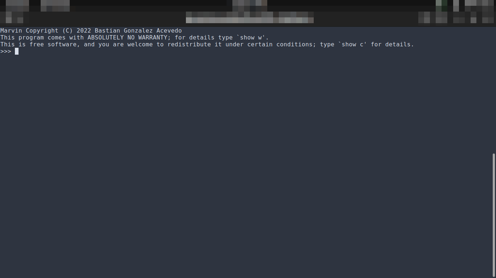

# Marvin
Marvin is terminal calculator written in Rust.

## Build
Build of Marvin is made by [Rust](https://www.rust-lang.org/) tool [Cargo](https://doc.rust-lang.org/cargo/)

To build Marvin, you can use the following command:

	*cargo build* to compile in debug mode
	*cargo build --release* to compile in release mode

To launch Marvin units tests, you can use the following command:

	*cargo test* to launch tests in debug mode
	*cargo test --release* to launch tests in release mode

## Documentation
Marvin use [Taz]("https://github.com/BaGoA/Taz") library to evaluate expression given by user. To interact with user, we have created a terminal user interface based on [Crossterm]("https://github.com/crossterm-rs/crossterm") library. 

Marvin application can be launched by Cargo with following command:

	*cargo run* to launch in debug mode
	*cargo run --release* to launch in release mode

Then we have following view

Examples of usage:

## Licensing
Marvin library is free software, you can redistribute it and/or modify it under the terms of the GNU General Public License.
