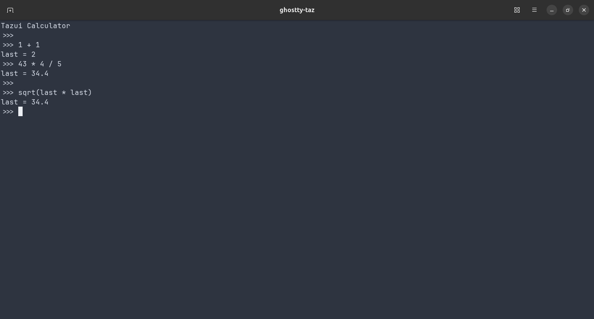

# Tazui
Tazui is terminal calculator written in Rust.

## Build
Build of Tazui is made by [Rust](https://www.rust-lang.org/) tool [Cargo](https://doc.rust-lang.org/cargo/)

To build Tazui, you can use the following command:

	*cargo build* to compile in debug mode
	*cargo build --release* to compile in release mode

To launch Tazui units tests, you can use the following command:

	*cargo test* to launch tests in debug mode
	*cargo test --release* to launch tests in release mode

## Documentation
Tazui use [Taz]("https://github.com/BaGoA/Taz") library to evaluate expression given by user. To interact with user, we have created a terminal user interface based on [Crossterm]("https://github.com/crossterm-rs/crossterm") library. 

Tazui application can be launched by Cargo with following command:

	*cargo run* to launch in debug mode
	*cargo run --release* to launch in release mode

Then we have following view

To quit Tazui application, we can write *quit* or use *ESC* key.

Tazui can work with simple expression and return result in variable named *last*. This can be reused in other expression.
Moreover, we can define variable with an expression. Tazui evaluate it and put result in this variable. Then we can reuse these variables in other expression.

Here are some examples:

## Licensing
Tazui library is free software, you can redistribute it and/or modify it under the terms of the GNU General Public License.
